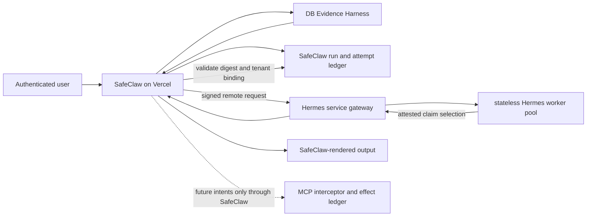

# Architecture Contract 0003: EngineAdapter Remote Hermes Boundary

Date: 2026-07-16
Status: Accepted boundary specification; production implementation and traffic cutover are not approved

## Decision Summary

SafeClaw may add Hermes as a remote planner runtime behind the existing
`EngineAdapter`, but the remote service is not a second SafeClaw backend. The
Vercel application remains the tenant-aware control plane and the SafeClaw
MCP/DB Evidence Harness remains the fact and effect authority.

The first remote contract is deliberately narrower than the long-term planner
roadmap:

- the current local OpenAI OAuth path remains a single-operator proof of
  concept and is never reused for contract customer traffic;
- contract traffic uses one centrally operated, stateless Hermes worker pool,
  authenticated as a service, with no per-organization or per-site runtime or
  OAuth copy;
- SafeClaw binds the authenticated user, organization, site, run, evidence,
  policy, and budget before calling the worker;
- SafeClaw sends a minimized, structurally redacted prompt projection under a
  versioned redaction policy, never the raw or merely normalized user prompt;
- the remote worker receives only a typed, minimized `claimsProjection` whose
  redacted claim/citation leaves and provenance are structurally classified;
- the remote worker receives no SafeClaw tool credentials or tool schemas, and
  its runtime policy denies all tools;
- approvals and externally visible effects remain SafeClaw-owned ledger events;
  the remote naturalizer cannot request, approve, or execute an effect;
- retries are budgeted SafeClaw attempts, not hidden autonomous loops; and
- Vercel calls a remote HTTPS boundary and never spawns or embeds a local
  Hermes/OpenClaw process in production.

This contract authorizes documentation and evaluation only. It does not
authorize a database migration, secret change, remote deployment, provider
account creation, production flag change, or customer traffic.

## Relationship To Existing Decisions

This document reconciles and narrows existing decisions. It does not replace
them.

| Existing record | Authority retained | Clarification added here |
| --- | --- | --- |
| [ADR 0001: SafeClaw Core and Agent Runtime Boundary](../adr/0001-agent-runtime-boundary.md) | SafeClaw MCP/DB Harness is the system of record; Hermes is an adapter; Phase 4 gates remain mandatory. | Defines the production remote transport, service-auth, tenant-binding, tool-deny, and Vercel boundary left open by the local POC. |
| [ADR 0002: Knowledge Promotion and Provenance Boundary](../adr/0002-knowledge-promotion-provenance-boundary.md) | Hermes output is candidate-only; human review and publication remain separate; no LLM-owned persistence. | Remote output is naturalization-only and cannot create a knowledge event, approval, or publication event. |
| [Phase B Organization Knowledge and Engine Plan](../phase-b-organization-knowledge-and-engine-plan.md) | Central stateless workers, organization/site attribution, usage limits, service auth, and no per-site OAuth copies. | Converts those decisions into a bounded request, response, retry, and deployment contract. |
| [Agent Runtime Long-Term Roadmap](../agent-runtime-long-term-roadmap.md) | Hermes promotion is deferred until parity, ledger, isolation, recovery, security, and operations gates pass. | Establishes a narrow remote naturalization slice before any effectful planner promotion. |
| [HRMS Hermes/SafeClaw Engine Gap Audit](../../evaluation/2026-07-10-hrms-hermes-safeclaw-engine-gap-audit.md) | Supporting audit evidence, not a normative architecture record. | Reuses its auth-plane separation and single-interceptor findings without copying the HRMS runtime design. |

If this contract conflicts with ADR 0001 or ADR 0002, those accepted ADRs win.
The Phase 4 promotion gate is unchanged. This contract does not revive the
rejected Hermes-as-core or automatic knowledge-promotion alternatives.

## Current State And Target State

### Current Local OAuth POC

The authoritative base already contains a guarded local experiment:

- `engine-adapter/v1` exposes `stream_text` and `request_read_tool` capabilities;
- `SAFECLAW_ENGINE_MODE=experimental-hermes` additionally requires
  `SAFECLAW_HERMES_LOCAL_POC=1`;
- any `VERCEL` environment disables the local experiment;
- one configured organization and site are matched against the broker context;
- the local runtime must attest an exact tool policy of `allow: []` and
  `deny: ["*"]`;
- OpenAI OAuth is checked on the local OpenClaw profile;
- SafeClaw obtains and freezes the DB Harness packet, validates
  `llmRole=naturalize_only`, and accepts only claim/citation IDs bound to the
  evidence digest; and
- unknown, harness, write, and document-generation tool requests are denied
  before the SafeClaw read executor.

This is useful conformance evidence. It is not service authentication, durable
multi-tenant execution, or a production Hermes deployment.

### Target Remote Slice

The first production-shaped slice adds a remote transport behind the adapter
without widening runtime authority. It is a **remote naturalizer**, not yet a
durable autonomous planner or executor.



The worker may scale horizontally. A worker process can disappear after any
request without losing product truth, approval state, effect state, or resume
state. Hermes session files, local databases, JSONL traces, and model memory are
diagnostic caches only and never operation memory.

## Remote Contract

The in-process adapter remains `engine-adapter/v1`. The network envelope is
versioned independently as `engine-remote/v1` so transport changes do not
silently change adapter semantics.

### Request Envelope

SafeClaw creates the envelope after user authentication, site authorization,
Evidence Harness validation, structural PII redaction, prompt minimization, and
budget allocation. User text or worker output must never be trusted to supply
these fields.

| Field | Contract |
| --- | --- |
| `contractVersion` | Exact value `engine-remote/v1`; unknown versions fail closed. |
| `runId` | SafeClaw-owned logical run identifier, stable across retries. |
| `logicalRequestDigest` | Digest of the stable logical request. It is identical across retries for the same work. |
| `requestId` / `attemptId` | Fresh identifiers for one transport attempt. Both change on every retry and are used for replay and late-response detection. |
| `organizationId` / `siteId` | Derived from the authenticated SafeClaw context and repeated in the signed service assertion. |
| `actorRef` | Opaque SafeClaw actor reference; no user credential or session token crosses the boundary. |
| `purpose` | Exact value `naturalize_only`. |
| `evidenceDigest` | SHA-256 digest of the immutable, validated Evidence Harness packet. |
| `claimsProjection` | Typed `claims-projection/v1` DTO containing only allowlisted, structurally classified claim/citation fields. Raw local claim or Evidence Harness objects are prohibited. |
| `claimsProjectionDigest` | Digest of the canonical typed claims projection. It is included in `redactionProof` and `logicalRequestDigest`. |
| `promptProjection` | SafeClaw-created, minimized projection containing only allowlisted task intent, jurisdiction, language, output intent, and non-identifying constraints. The raw or normalized user prompt is prohibited. |
| `promptProjectionDigest` | Digest of the canonical minimized projection. |
| `redactionProof` | Non-sensitive proof containing prompt and claims projection schema versions, `redactionPolicyVersion`, claims field-classification policy version/digest, `promptProjectionDigest`, `claimsProjectionDigest`, source-field classification digest, and a terminal `piiDisposition` accepted by policy. It contains no removed values. |
| `policyVersion` | Tool-deny, output-attestation, and model-routing policy snapshot. Redaction is separately pinned by `redactionPolicyVersion` in `redactionProof`. |
| `logicalBudget` | Stable end-to-end deadline, provider-call allowance, output-byte allowance, and retry allowance assigned to the logical run. |
| `attemptBudget` | Remaining allowance for this attempt; it may narrow but never expand `logicalBudget`. |
| `issuedAt` / `expiresAt` | Fresh, short validity window for this attempt, checked by the service gateway. |
| `attemptEnvelopeDigest` | Digest of the complete unsigned attempt envelope, including `logicalRequestDigest`, `requestId`, `attemptId`, attempt budget, timestamps, nonce, and service-auth issuer/audience/key reference. Signature bytes are excluded to avoid a circular digest. |

SafeClaw computes two different digests:

1. `logicalRequestDigest` covers canonical stable fields: contract version,
   run, tenant, opaque actor reference, purpose, `evidenceDigest`,
   `claimsProjectionDigest`, prompt projection and redaction proof, policy
   version, and logical budget. It explicitly excludes `requestId`,
   `attemptId`, `issuedAt`, `expiresAt`, attempt number, transport nonce, and
   attempt-specific remaining budget.
2. `attemptEnvelopeDigest` covers the complete concrete attempt, including the
   stable `logicalRequestDigest` plus fresh `requestId`, `attemptId`, timestamps,
   nonce, attempt budget, and service assertion metadata. The SafeClaw service
   identity signs this digest, not the logical digest alone; signature bytes
   are not input to the digest.

A change to tenant, prompt projection, claims projection, redaction proof or
policy, evidence, execution policy, or logical budget creates a new
`logicalRequestDigest`. Every retry keeps that logical digest,
`evidenceDigest`, and `claimsProjectionDigest` but creates a new `requestId`,
`attemptId`, validity window, `attemptEnvelopeDigest`, and signature.

### Typed Claims Projection

SafeClaw must project local evidence claims into `claims-projection/v1` before
remote dispatch. The projection is a closed DTO, not a renamed local
`HermesEvidenceClaim`, DB Harness packet fragment, ORM row, or object spread.
Its only allowed shape is:

```text
claimsProjection:
  schemaVersion: "claims-projection/v1"
  entries[]:
    claimId
    text
    citations[]:
      citationId
      displayLabel
      provenanceClass
      sourceRefDigest
  fieldClassifications:
    <JSON pointer for every scalar leaf>: <allowed classification>
```

`claimId` and `citationId` are opaque identifiers. `text` contains only the
minimum redacted, allowlisted safety statement needed for naturalization.
`displayLabel` contains only an approved public label, never a raw document
title, URL, filename, person, site, free-text note, or local record label.
`sourceRefDigest` is a non-reversible source reference digest. The only allowed
`provenanceClass` values in the remote slice are `current_law`, `kosha_guide`,
`sif_case`, and `published_ontology`; organization history, site operation
memory, photos, acknowledgements, and unreviewed candidates do not cross this
boundary.

Every scalar leaf present in `entries` must have exactly one corresponding
JSON-pointer entry in `fieldClassifications`, and no classification entry may
refer to an absent field. Allowed classifications are closed and versioned:
`opaque_claim_id`, `public_safety_claim_text`, `opaque_citation_id`,
`public_source_label`, `public_provenance_class`, and
`non_reversible_source_digest`. The schema rejects additional properties.

Before dispatch, SafeClaw verifies projection schema, provenance allowlist,
field-classification completeness, redaction disposition, text/label length,
identifier shape, duplicate IDs, citation ownership, and canonical digest. An
unknown field, missing/extra classification, disallowed provenance, raw local
claim property, PII detection, unrestricted text, or digest mismatch fails
closed before remote dispatch. The request becomes `review_required`; no raw
claim object or best-effort fallback is sent.

`redactionProof` includes `claimsProjectionDigest`, claims projection schema
version, field-classification policy version, and a digest of the complete
classification map. It contains no removed claim values. Both
`claimsProjectionDigest` and that proof are covered by
`logicalRequestDigest`, so a retry cannot substitute claim text, citations,
provenance, or classifications while retaining the logical identity.

### Prompt Projection And Structural Redaction

SafeClaw must not dispatch the raw user prompt, a normalized copy of it, or an
arbitrary free-text blob with best-effort substitutions. Before constructing a
remote envelope, SafeClaw creates a typed projection from an allowlist such as:

- task or document intent;
- jurisdiction and requested language;
- approved work category and non-identifying operating constraints;
- requested output shape; and
- references to already-redacted claim IDs, never embedded raw records.

Structural PII redaction happens before projection canonicalization. SafeClaw
classifies every candidate source field by schema and provenance, removes
identity/contact/account/signature/address and unrestricted-note fields, and
tokenizes an allowed quasi-identifier only when the pinned policy defines a
non-reversible representation. Regex replacement alone is not proof because it
cannot establish which source fields were considered.

The local redaction gate emits `redactionProof` only when all source fields are
classified, every included projection field is allowlisted, removed values are
absent, and the canonical projection passes the pinned policy. The service
gateway accepts only supported projection-schema and redaction-policy versions
and verifies that `redactionProof.promptProjectionDigest` equals
`promptProjectionDigest`, `redactionProof.claimsProjectionDigest` equals
`claimsProjectionDigest`, and the claims classification-map digest matches the
canonical typed projection.

If SafeClaw cannot prove field coverage, encounters an unknown field class,
cannot remove or safely tokenize detected PII, or cannot reproduce the
projection digest, it fails closed before remote dispatch. The request enters a
local review-required state; no fallback may send the raw prompt or relax the
redaction policy. Raw prompts and removed values are also excluded from ordinary
logs, retry envelopes, receipts, and evaluation exports.

### Response Envelope

The service returns a closed, discriminated `engine-remote-response/v1`
envelope. Common unsigned fields are:

```text
responseVersion
kind: "success" | "failure"
runId
logicalRequestDigest
requestId
attemptId
organizationId
siteId
attemptEnvelopeDigest
promptProjectionDigest
claimsProjectionDigest
evidenceDigest
usage
latencyMs
terminalStatus
```

`usage` is present in both variants and contains the provider/model reference,
input/output usage counters, and `usageComplete`. Unknown counters are explicit
nulls with `usageComplete=false`, not omitted fields.

The variants are mutually exclusive:

- `kind="success"` requires `terminalStatus="succeeded"` and
  `selectedClaims[]`, where each entry contains one `claimId` and a non-empty
  list of `citationIds`. It prohibits `error`.
- `kind="failure"` requires `terminalStatus="failed"` and `error`, containing
  `taxonomyVersion="engine-remote-error/v1"`, one known `code`, and an optional
  bounded non-sensitive diagnostics reference. It prohibits `selectedClaims`.

Additional properties, mixed variants, missing usage, an unknown terminal
status, or selected claim/citation IDs outside `claimsProjection` make the
response invalid.

The service computes `responseEnvelopeDigest` over canonical JSON containing
**every unsigned response field**, including the discriminant, all echoed
request/tenant/digest bindings, the complete selected claim/citation structure
for success, the complete error structure for failure, usage, latency, and
terminal status. The digest excludes only `responseEnvelopeDigest` itself and
the signature/receipt fields to avoid recursion.

The service appends `responseEnvelopeDigest`, then returns `serviceReceipt`
with that digest, service key reference, and signature. The signature is
domain-separated and binds
`responseEnvelopeDigest` to `attemptEnvelopeDigest`, response version, and
service identity. A receipt or signature over only selected fields is invalid.

SafeClaw recomputes `responseEnvelopeDigest`, verifies the receipt and both
request digests, checks all echoed bindings, IDs, expiry, claim/citation
membership, usage limits, and variant rules before rendering or recording a
validated remote failure. A response for a different or superseded attempt is
never accepted merely because its logical digest matches. The worker's prose is
never accepted directly. SafeClaw renders validated fixed claims and citations,
preserving the current `hermes-output-attestation/v1` behavior.

### Versioned Error Taxonomy And Retry Ownership

`engine-remote-error/v1` is a closed taxonomy. Unknown codes fail response
validation. SafeClaw also uses the same taxonomy for locally observed transport
and validation failures that cannot produce a signed service response.

| Error code | Origin | SafeClaw base disposition |
| --- | --- | --- |
| `REMOTE_AUTH_REJECTED` | gateway | `terminal_failure` |
| `REMOTE_TENANT_BINDING_REJECTED` | gateway | `terminal_failure` |
| `REMOTE_REPLAY_REJECTED` | gateway | `terminal_failure` |
| `REMOTE_CONTRACT_UNSUPPORTED` | gateway | `terminal_failure` |
| `REMOTE_REDACTION_POLICY_REJECTED` | gateway or SafeClaw validation | `review_required` |
| `REMOTE_CLAIMS_PROJECTION_REJECTED` | gateway or SafeClaw validation | `review_required` |
| `REMOTE_TOOL_POLICY_VIOLATION` | gateway or worker policy monitor | `terminal_failure` |
| `REMOTE_OUTPUT_ATTESTATION_INVALID` | SafeClaw validation | `terminal_failure` |
| `REMOTE_RESPONSE_INVALID` | SafeClaw validation | `terminal_failure` |
| `REMOTE_RESPONSE_SIGNATURE_INVALID` | SafeClaw validation | `terminal_failure` |
| `REMOTE_BUDGET_EXHAUSTED` | gateway or SafeClaw budget check | `terminal_failure` |
| `REMOTE_WORKER_OVERLOADED` | gateway | `retry_new_attempt` |
| `REMOTE_PROVIDER_UNAVAILABLE` | worker | `retry_new_attempt` |
| `REMOTE_PROVIDER_TIMEOUT` | worker | `retry_new_attempt` |
| `REMOTE_TRANSPORT_UNAVAILABLE` | SafeClaw transport client | `retry_new_attempt` |
| `REMOTE_INTERNAL_FAILURE` | gateway or worker | `terminal_failure` |

The worker and gateway do not return `retryable`, `retryDisposition`, or an
authoritative retry class. They report only a taxonomy version, code, and
bounded facts. SafeClaw owns `engine-remote-retry-policy/v1`, validates the
error origin and signed envelope when present, maps the code to the table, then
applies remaining attempt count, logical deadline, budget, supersession, and
receipt state. A base `retry_new_attempt` becomes `terminal_failure` when any
limit is exhausted. A transport `Retry-After` value may affect scheduling only
after SafeClaw has independently selected `retry_new_attempt`.

Unknown codes, malformed/unsigned failure envelopes, signature failures,
policy violations, and ambiguous outcomes never inherit a transient class.
The ledger records taxonomy version, observed code, retry-policy version,
validated origin, deterministic disposition, and the policy inputs. The worker
cannot choose whether SafeClaw retries.

## Authentication And Tenant Binding

Authentication stays split into independent planes.

| Plane | Proves | Required owner and rule |
| --- | --- | --- |
| User auth | Who requested or approved work | Supabase Auth and SafeClaw org/site role checks. Never forwarded to Hermes. |
| SafeClaw-to-Hermes service auth | An approved SafeClaw deployment called the worker service | Prefer workload identity with audience-bound, short-lived credentials. A rotated machine credential in a managed secret store is an interim fallback, not a site credential. |
| Provider auth | Which model account pays for inference | Central runtime vault or provider service account. No customer OAuth refresh token and no operator OAuth profile in contract traffic. |
| Tenant capability | Which tenant-bound attempt this worker may process | Short-lived signed assertion binding service identity, logical request digest, attempt envelope digest, run, request, attempt, organization, site, purpose, evidence digest, prompt and claims projection digests, redaction/classification policies, budgets, and expiry. |
| MCP/effect capability | Which exact tool step may execute | SafeClaw-only, step-bound, one-time capability. It is not issued in the remote naturalization slice. |

The service gateway rejects missing, expired, replayed, wrong-audience,
wrong-issuer, unsupported-redaction-policy, or digest-mismatched assertions
before queueing work. Reusing a `requestId` or `attemptId`, or presenting a
valid logical digest with the wrong attempt envelope, is a replay failure. The
worker must echo the signed tenant binding and both digests, but that echo does
not grant authority; SafeClaw verifies them again on response.

One central worker pool serves all tenants through these per-request bindings.
There is no Hermes deployment, runtime home, OAuth profile, queue, or provider
account copied per site. Capacity and billing may be attributed per
organization/site in the SafeClaw ledger without making credentials tenant
specific.

No per-site OAuth copies are permitted.

## Stateless Worker Pool

Workers have:

- access only to the verified request envelope, minimized prompt and claims
  projections, and central provider credential needed for model inference;
- no Supabase service role, database connection string, SafeClaw user session,
  customer OAuth credential, or general MCP token;
- no durable tenant memory and no cross-request conversation state;
- no tenant-selected plugins, shell, browser, filesystem, or network tools;
- bounded temporary storage that is destroyed after the attempt; and
- structured logs keyed by opaque run/attempt IDs, with no raw prompt or
  removed PII and with the projection governed by the same redaction policy.

Queue scheduling may use organization/site attribution for fairness and caps,
but a worker is fungible. Sticky routing and site-specific runtime homes are
prohibited. A retry may run on any worker because all authoritative inputs are
in the signed envelope and all authoritative results are recorded by SafeClaw.

## Evidence Harness And Tool Deny

The remote slice preserves the DB Harness generation contract:

- `mode=db_harness_first`;
- `llmRole=naturalize_only`;
- `llmOutputScope=rewrite_fixed_evidence_only`;
- `evidenceAuthority=db_harness`;
- `providerRetryScope=naturalization_retry_only`;
- `fallbackChainAllowed=false`; and
- `genericProseSubstitutionAllowed=false`.

SafeClaw performs retrieval, validates completeness, and builds the minimized
redacted prompt and claims projections before remote dispatch. The worker
receives only those typed projections, not the raw prompt, local claim objects,
or authority to search for missing facts. Missing or stale evidence, an
unknown/PII-bearing claim field, or an unprovable redaction/classification
result returns `review_required` from SafeClaw and no remote call is made.

Tool denial is enforced twice:

1. SafeClaw sends no tool schemas, MCP credential, or tool executor callback in
   `engine-remote/v1`.
2. The Hermes service policy must attest `allow: []` and `deny: ["*"]` before
   accepting traffic.

Any model tool call, shell request, URL fetch, plugin request, document write,
or claimed external action is a protocol violation. SafeClaw records the
attempt as failed and emits no candidate output. Prompt instructions are not
the security boundary; gateway configuration and response validation are.

## Approval And Effect Ledger

The remote naturalizer has no approval or effect capability. It cannot:

- interpret model text or a boolean as human approval;
- create, approve, reject, expire, or reuse an approval request;
- write a workpack, candidate, ontology node, organization knowledge item, or
  site operation-memory event;
- send an email, message, webhook, file, or notification; or
- mark an effect successful.

SafeClaw records the remote request and attempt in its ledger with request and
response digests, tenant binding, policy version, budget, provider usage,
terminal state, and sanitized failure reason. This documentation does not
approve the schema needed for that ledger.

Future planner contracts may return tool **intents** only. Before any such
intent can execute, ADR 0001's full path remains mandatory:

```text
intent -> SafeClaw registry validation -> durable step -> approval when required
       -> one-time step capability -> MCP interceptor -> effect receipt
```

Approval is bound to the exact tenant, run, step, canonical payload digest,
effect class, actor session, expiry, and nonce. Changed payloads require a new
approval. Retries consult the effect receipt before execution; unknown effect
outcomes stop for operator resolution rather than guessing.

## Retries, Deadlines, And Budgets

SafeClaw allocates and enforces the budget. The worker may not expand it.

The initial remote naturalization policy is:

| Limit | Initial contract |
| --- | --- |
| Remote attempts | At most two total attempts for one logical run, including the first attempt. |
| Provider calls | At most one provider call per attempt. |
| Tool calls | Zero. |
| Premium-model escalation | Zero unless a later policy and explicit product gate authorize it. |
| Output | Structured claim selection only, bounded by an explicit byte limit in the request. |
| Time | Each attempt and the end-to-end run must have caller-supplied deadlines; worker timeout cannot extend the SafeClaw deadline. |

Retry eligibility starts only when SafeClaw maps
`REMOTE_WORKER_OVERLOADED`, `REMOTE_PROVIDER_UNAVAILABLE`,
`REMOTE_PROVIDER_TIMEOUT`, or `REMOTE_TRANSPORT_UNAVAILABLE` to the base
disposition `retry_new_attempt`, and only while attempt, deadline, and budget
limits remain. Retries are forbidden for:

- authentication, authorization, tenant-binding, replay, or signature failure;
- contract-version, policy-attestation, evidence-digest, or output-attestation
  failure;
- any tool request or other policy violation;
- invalid input or exhausted budget; and
- an unknown result that cannot be reconciled by `requestId` and `attemptId`.

SafeClaw calculates backoff after applying
`engine-remote-retry-policy/v1` and records the policy inputs and disposition.
The gateway may report bounded load timing facts, but neither gateway nor model
runtime can select the retry class or recursively retry. A retry keeps the same
`runId`, `logicalRequestDigest`, `evidenceDigest`, `promptProjectionDigest`, and
`claimsProjectionDigest`. It receives a new `requestId`, `attemptId`,
`issuedAt`, `expiresAt`, transport nonce, `attemptEnvelopeDigest`, and service
signature. Late responses from superseded attempts are recorded and ignored,
even when their logical digest remains valid.

Provider usage, response bytes, elapsed time, attempts, and retry reason feed
the organization/site usage ledger. Budget exhaustion is a terminal,
user-safe failure, not permission to fall back to ungrounded prose or another
untracked model.

## Vercel Remote Boundary

Production Vercel code is the control-plane client. It may authenticate the
user, authorize the site, obtain and validate the Evidence Harness packet,
construct and prove the minimized redacted prompt and typed claims projections,
allocate a budget, calculate the logical and attempt digests, sign the attempt
envelope, validate the discriminated response and response receipt, apply the
SafeClaw retry policy, record the attempt, and render accepted claims.

Production Vercel code must not:

- spawn OpenClaw or Hermes subprocesses;
- rely on a local runtime home, SQLite file, OAuth profile, or filesystem queue;
- hold a long-lived provider refresh token for a human operator;
- send a raw or merely normalized user prompt, unknown source field, or
  unproven redaction result to the remote service;
- send a raw local claim, unclassified claim/citation field, disallowed
  provenance, or PII-bearing claims projection;
- trust platform request retries as the durable retry ledger;
- pass a Supabase service role or unrestricted MCP token to the worker; or
- enable the remote path merely because an environment flag exists.

The remote path requires an explicit rollout allowlist plus successful service
identity, policy-attestation, tenant-isolation, budget, and ledger preflight.
When the remote service is unavailable or any attestation fails, SafeClaw fails
closed for the remote path. It may use a separately approved deterministic or
OpenClaw compatibility path only if that path consumes the same validated
Evidence Harness packet and records an independent adapter attempt.

## Failure Contract And Observability

Public errors remain generic. Internal records distinguish at least:

- service-auth failure;
- tenant-binding, logical/attempt digest, or replay failure;
- unsupported or unprovable prompt-projection/redaction policy;
- worker unavailable or overloaded;
- provider unavailable or timed out;
- budget exhausted;
- policy or tool-deny violation;
- evidence or response attestation failure;
- malformed remote contract; and
- late or duplicate response.

Every attempt is reconstructable from `runId` to `logicalRequestDigest`, fresh
request and attempt IDs, `attemptEnvelopeDigest`, prompt and claims projection
digests, redaction/classification/execution policy versions, evidence digest,
service identity reference, worker pool reference, provider/model reference,
usage, error-taxonomy and retry-policy versions, deterministic retry
disposition, `responseEnvelopeDigest`, receipt, and terminal state. Secrets,
raw credentials, raw prompts/claims, unrestricted tenant payloads, removed
values, and unredacted PII are excluded from ordinary logs and evaluation
exports.

Health checks prove process readiness only. They do not prove tenant binding,
Evidence Harness adherence, tool denial, or provider usability. Promotion
evidence must include signed end-to-end conformance runs.

## Rollout Gates

Implementation proceeds in separately approved slices:

1. **Contract fixtures:** freeze canonical request/response examples, prompt and
   claims projection/redaction fixtures, logical/attempt/response digest rules,
   discriminated response variants, error taxonomy, retry mapping, and
   local-versus-remote parity tests.
2. **Service identity:** verify short-lived audience-bound service auth and
   rotation without customer or operator OAuth credentials.
3. **Stateless shadow:** run tool-free naturalization on synthetic or approved
   test packets; no customer-visible output.
4. **Tenant isolation:** prove swapped org/site, raw/unknown PII fields,
   unsupported redaction policy, reused request/attempt IDs, mismatched attempt
   digest, replay, late response, queue reuse, logging, and worker-restart cases
   fail closed.
5. **Budget and recovery:** prove deadlines, SafeClaw-owned deterministic retry
   classification, unknown-code rejection, duplicate suppression, usage
   attribution, and service outage behavior.
6. **Ledger readiness:** separately approve any database migration, RLS policy,
   retention policy, and operator UI needed for durable attempts.
7. **Limited canary:** require explicit production promotion approval and a
   rollback path. Naturalization remains tool-free.
8. **Planner expansion:** only after ADR 0001's Phase 4 gates; effectful intents
   remain a separate contract and approval.

## Non-Goals

This contract does not define or approve:

- a database schema or migration;
- a queue vendor, worker language, container platform, or model provider;
- a billing product or price;
- per-site Hermes instances, runtime homes, OAuth profiles, or provider keys;
- direct Hermes access to Supabase, tenant retrieval, MCP, email, messaging, or
  document storage;
- automatic knowledge promotion or runtime self-modification;
- effectful planner traffic; or
- retirement of the OpenClaw parity and failover role.

## Acceptance Criteria

The remote naturalization boundary is ready for a separately approved canary
only when executable evidence shows all of the following:

- the Vercel production path uses remote service auth and contains no local
  process dependency;
- operator OAuth and customer OAuth credentials are absent from contract
  traffic and worker configuration;
- one shared worker pool handles multiple test tenants without retained state
  or cross-tenant disclosure;
- org/site swaps, replay, expiry, signature mismatch, evidence mutation, and
  late responses fail closed;
- raw or normalized prompts never cross the remote boundary; only a minimized
  projection with a supported `redactionPolicyVersion` and reproducible
  structural-redaction proof can be dispatched;
- raw local claim objects never cross the boundary; every field in the typed
  `claimsProjection` is allowlisted, structurally classified, PII-checked, and
  bound by `claimsProjectionDigest` in both `redactionProof` and
  `logicalRequestDigest`;
- retries preserve `logicalRequestDigest`, `evidenceDigest`, and the prompt
  and claims projections while each attempt uses fresh request/attempt IDs,
  timestamps, `attemptEnvelopeDigest`, and signature;
- every worker has a verified tool policy of `allow: []`, `deny: ["*"]`, and a
  model tool call cannot reach an executor;
- only allowlisted claims and citations matching the Evidence Harness digest
  can reach rendered output;
- success and failure responses are mutually exclusive, every response field
  is bound by `responseEnvelopeDigest`, and the service receipt signs that
  digest for the exact attempt;
- SafeClaw validates `engine-remote-error/v1` and exclusively determines retry
  disposition under `engine-remote-retry-policy/v1`; retries remain within the
  signed budget and never turn unknown or policy failures into retries;
- request, attempt, usage, failure, and accepted response receipts are
  reconstructable without secrets or raw PII; and
- no database write, external send, approval, or publication can be caused by
  the remote naturalizer.
