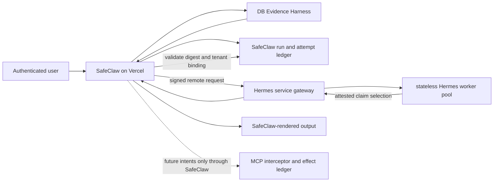

# Architecture Contract 0003: EngineAdapter Remote Hermes Boundary

Date: 2026-07-16
Status: Accepted boundary specification; production implementation and traffic cutover are not approved

## Decision Summary

SafeClaw may add Hermes as a remote planner runtime behind the existing
`EngineAdapter`, but the remote service is not a second SafeClaw backend. The
Vercel application remains the tenant-aware control plane and the SafeClaw
MCP/DB Evidence Harness remains the fact and effect authority.

The first remote contract is deliberately narrower than the long-term planner
roadmap:

- the current local OpenAI OAuth path remains a single-operator proof of
  concept and is never reused for contract customer traffic;
- contract traffic uses one centrally operated, stateless Hermes worker pool,
  authenticated as a service, with no per-organization or per-site runtime or
  OAuth copy;
- SafeClaw binds the authenticated user, organization, site, run, evidence,
  policy, and budget before calling the worker;
- the remote worker receives only the bounded claim allowlist needed for
  `naturalize_only` output;
- the remote worker receives no SafeClaw tool credentials or tool schemas, and
  its runtime policy denies all tools;
- approvals and externally visible effects remain SafeClaw-owned ledger events;
  the remote naturalizer cannot request, approve, or execute an effect;
- retries are budgeted SafeClaw attempts, not hidden autonomous loops; and
- Vercel calls a remote HTTPS boundary and never spawns or embeds a local
  Hermes/OpenClaw process in production.

This contract authorizes documentation and evaluation only. It does not
authorize a database migration, secret change, remote deployment, provider
account creation, production flag change, or customer traffic.

## Relationship To Existing Decisions

This document reconciles and narrows existing decisions. It does not replace
them.

| Existing record | Authority retained | Clarification added here |
| --- | --- | --- |
| [ADR 0001: SafeClaw Core and Agent Runtime Boundary](../adr/0001-agent-runtime-boundary.md) | SafeClaw MCP/DB Harness is the system of record; Hermes is an adapter; Phase 4 gates remain mandatory. | Defines the production remote transport, service-auth, tenant-binding, tool-deny, and Vercel boundary left open by the local POC. |
| [ADR 0002: Knowledge Promotion and Provenance Boundary](../adr/0002-knowledge-promotion-provenance-boundary.md) | Hermes output is candidate-only; human review and publication remain separate; no LLM-owned persistence. | Remote output is naturalization-only and cannot create a knowledge event, approval, or publication event. |
| [Phase B Organization Knowledge and Engine Plan](../phase-b-organization-knowledge-and-engine-plan.md) | Central stateless workers, organization/site attribution, usage limits, service auth, and no per-site OAuth copies. | Converts those decisions into a bounded request, response, retry, and deployment contract. |
| [Agent Runtime Long-Term Roadmap](../agent-runtime-long-term-roadmap.md) | Hermes promotion is deferred until parity, ledger, isolation, recovery, security, and operations gates pass. | Establishes a narrow remote naturalization slice before any effectful planner promotion. |
| [HRMS Hermes/SafeClaw Engine Gap Audit](../../evaluation/2026-07-10-hrms-hermes-safeclaw-engine-gap-audit.md) | Supporting audit evidence, not a normative architecture record. | Reuses its auth-plane separation and single-interceptor findings without copying the HRMS runtime design. |

If this contract conflicts with ADR 0001 or ADR 0002, those accepted ADRs win.
The Phase 4 promotion gate is unchanged. This contract does not revive the
rejected Hermes-as-core or automatic knowledge-promotion alternatives.

## Current State And Target State

### Current Local OAuth POC

The authoritative base already contains a guarded local experiment:

- `engine-adapter/v1` exposes `stream_text` and `request_read_tool` capabilities;
- `SAFECLAW_ENGINE_MODE=experimental-hermes` additionally requires
  `SAFECLAW_HERMES_LOCAL_POC=1`;
- any `VERCEL` environment disables the local experiment;
- one configured organization and site are matched against the broker context;
- the local runtime must attest an exact tool policy of `allow: []` and
  `deny: ["*"]`;
- OpenAI OAuth is checked on the local OpenClaw profile;
- SafeClaw obtains and freezes the DB Harness packet, validates
  `llmRole=naturalize_only`, and accepts only claim/citation IDs bound to the
  evidence digest; and
- unknown, harness, write, and document-generation tool requests are denied
  before the SafeClaw read executor.

This is useful conformance evidence. It is not service authentication, durable
multi-tenant execution, or a production Hermes deployment.

### Target Remote Slice

The first production-shaped slice adds a remote transport behind the adapter
without widening runtime authority. It is a **remote naturalizer**, not yet a
durable autonomous planner or executor.



The worker may scale horizontally. A worker process can disappear after any
request without losing product truth, approval state, effect state, or resume
state. Hermes session files, local databases, JSONL traces, and model memory are
diagnostic caches only and never operation memory.

## Remote Contract

The in-process adapter remains `engine-adapter/v1`. The network envelope is
versioned independently as `engine-remote/v1` so transport changes do not
silently change adapter semantics.

### Request Envelope

SafeClaw creates the envelope after user authentication, site authorization,
Evidence Harness validation, and budget allocation. User text or worker output
must never be trusted to supply these fields.

| Field | Contract |
| --- | --- |
| `contractVersion` | Exact value `engine-remote/v1`; unknown versions fail closed. |
| `requestId` | Unique transport request identifier used for replay detection. |
| `runId` / `attemptId` | SafeClaw-owned logical run and concrete attempt identifiers. |
| `organizationId` / `siteId` | Derived from the authenticated SafeClaw context and repeated in the signed service assertion. |
| `actorRef` | Opaque SafeClaw actor reference; no user credential or session token crosses the boundary. |
| `purpose` | Exact value `naturalize_only`. |
| `evidenceDigest` | SHA-256 digest of the immutable, validated Evidence Harness packet. |
| `claims` | Bounded claim and citation allowlist. Raw tenant records and unrestricted retrieval context are excluded. |
| `prompt` | Normalized user request after SafeClaw input policy checks. |
| `policyVersion` | Tool-deny, output-attestation, redaction, and model-routing policy snapshot. |
| `budget` | Hard deadline, provider-call allowance, output-byte allowance, and retry allowance assigned by SafeClaw. |
| `issuedAt` / `expiresAt` | Short validity window checked by the service gateway. |

The signed canonical request digest covers every field above. A change to the
tenant, prompt, evidence, policy, or budget creates a different request and
invalidates any prior response or approval association.

### Response Envelope

The service returns structured data only:

- `contractVersion`, `requestId`, `runId`, and `attemptId`;
- echoed `organizationId` and `siteId`;
- the accepted request digest and `evidenceDigest`;
- selected claim IDs and only their allowed citation IDs;
- provider/model reference, usage counters, latency, and terminal status;
- a service response signature or gateway-verifiable receipt; and
- a sanitized error code when no valid attestation can be returned.

SafeClaw validates all echoed bindings, digests, IDs, expiry, claim membership,
citation membership, usage limits, and receipt authenticity before rendering
text. The worker's prose is never accepted directly. SafeClaw renders the
validated fixed claims and citations, preserving the current
`hermes-output-attestation/v1` behavior.

## Authentication And Tenant Binding

Authentication stays split into independent planes.

| Plane | Proves | Required owner and rule |
| --- | --- | --- |
| User auth | Who requested or approved work | Supabase Auth and SafeClaw org/site role checks. Never forwarded to Hermes. |
| SafeClaw-to-Hermes service auth | An approved SafeClaw deployment called the worker service | Prefer workload identity with audience-bound, short-lived credentials. A rotated machine credential in a managed secret store is an interim fallback, not a site credential. |
| Provider auth | Which model account pays for inference | Central runtime vault or provider service account. No customer OAuth refresh token and no operator OAuth profile in contract traffic. |
| Tenant capability | Which tenant-bound request this worker may process | Short-lived signed assertion binding service identity, run, attempt, organization, site, purpose, evidence digest, policy, budget, and expiry. |
| MCP/effect capability | Which exact tool step may execute | SafeClaw-only, step-bound, one-time capability. It is not issued in the remote naturalization slice. |

The service gateway rejects missing, expired, replayed, wrong-audience,
wrong-issuer, or digest-mismatched assertions before queueing work. The worker
must echo the signed tenant binding, but that echo does not grant authority;
SafeClaw verifies it again on response.

One central worker pool serves all tenants through these per-request bindings.
There is no Hermes deployment, runtime home, OAuth profile, queue, or provider
account copied per site. Capacity and billing may be attributed per
organization/site in the SafeClaw ledger without making credentials tenant
specific.

No per-site OAuth copies are permitted.

## Stateless Worker Pool

Workers have:

- access only to the verified request envelope and central provider credential
  needed for model inference;
- no Supabase service role, database connection string, SafeClaw user session,
  customer OAuth credential, or general MCP token;
- no durable tenant memory and no cross-request conversation state;
- no tenant-selected plugins, shell, browser, filesystem, or network tools;
- bounded temporary storage that is destroyed after the attempt; and
- structured logs keyed by opaque run/attempt IDs, with prompts and tenant data
  redacted by default.

Queue scheduling may use organization/site attribution for fairness and caps,
but a worker is fungible. Sticky routing and site-specific runtime homes are
prohibited. A retry may run on any worker because all authoritative inputs are
in the signed envelope and all authoritative results are recorded by SafeClaw.

## Evidence Harness And Tool Deny

The remote slice preserves the DB Harness generation contract:

- `mode=db_harness_first`;
- `llmRole=naturalize_only`;
- `llmOutputScope=rewrite_fixed_evidence_only`;
- `evidenceAuthority=db_harness`;
- `providerRetryScope=naturalization_retry_only`;
- `fallbackChainAllowed=false`; and
- `genericProseSubstitutionAllowed=false`.

SafeClaw performs retrieval and validates completeness before remote dispatch.
The worker receives the claim allowlist, not authority to search for missing
facts. Missing or stale evidence returns `review_required` from SafeClaw and no
remote call is made.

Tool denial is enforced twice:

1. SafeClaw sends no tool schemas, MCP credential, or tool executor callback in
   `engine-remote/v1`.
2. The Hermes service policy must attest `allow: []` and `deny: ["*"]` before
   accepting traffic.

Any model tool call, shell request, URL fetch, plugin request, document write,
or claimed external action is a protocol violation. SafeClaw records the
attempt as failed and emits no candidate output. Prompt instructions are not
the security boundary; gateway configuration and response validation are.

## Approval And Effect Ledger

The remote naturalizer has no approval or effect capability. It cannot:

- interpret model text or a boolean as human approval;
- create, approve, reject, expire, or reuse an approval request;
- write a workpack, candidate, ontology node, organization knowledge item, or
  site operation-memory event;
- send an email, message, webhook, file, or notification; or
- mark an effect successful.

SafeClaw records the remote request and attempt in its ledger with request and
response digests, tenant binding, policy version, budget, provider usage,
terminal state, and sanitized failure reason. This documentation does not
approve the schema needed for that ledger.

Future planner contracts may return tool **intents** only. Before any such
intent can execute, ADR 0001's full path remains mandatory:

```text
intent -> SafeClaw registry validation -> durable step -> approval when required
       -> one-time step capability -> MCP interceptor -> effect receipt
```

Approval is bound to the exact tenant, run, step, canonical payload digest,
effect class, actor session, expiry, and nonce. Changed payloads require a new
approval. Retries consult the effect receipt before execution; unknown effect
outcomes stop for operator resolution rather than guessing.

## Retries, Deadlines, And Budgets

SafeClaw allocates and enforces the budget. The worker may not expand it.

The initial remote naturalization policy is:

| Limit | Initial contract |
| --- | --- |
| Remote attempts | At most two total attempts for one logical run, including the first attempt. |
| Provider calls | At most one provider call per attempt. |
| Tool calls | Zero. |
| Premium-model escalation | Zero unless a later policy and explicit product gate authorize it. |
| Output | Structured claim selection only, bounded by an explicit byte limit in the request. |
| Time | Each attempt and the end-to-end run must have caller-supplied deadlines; worker timeout cannot extend the SafeClaw deadline. |

Retries are allowed only for a classified transient transport failure, gateway
overload, or provider availability failure, and only while both the attempt
count and end-to-end deadline remain. Retries are forbidden for:

- authentication, authorization, tenant-binding, replay, or signature failure;
- contract-version, policy-attestation, evidence-digest, or output-attestation
  failure;
- any tool request or other policy violation;
- invalid input or exhausted budget; and
- an unknown result that cannot be reconciled by `requestId` and `attemptId`.

Backoff is calculated by SafeClaw or the service gateway and recorded with the
reason. The model runtime cannot recursively retry itself. A retry keeps the
same `runId` and request digest but receives a new `attemptId`; late responses
from superseded attempts are recorded and ignored.

Provider usage, response bytes, elapsed time, attempts, and retry reason feed
the organization/site usage ledger. Budget exhaustion is a terminal,
user-safe failure, not permission to fall back to ungrounded prose or another
untracked model.

## Vercel Remote Boundary

Production Vercel code is the control-plane client. It may authenticate the
user, authorize the site, obtain and validate the Evidence Harness packet,
allocate a budget, sign a remote request, validate the response, record the
attempt, and render accepted claims.

Production Vercel code must not:

- spawn OpenClaw or Hermes subprocesses;
- rely on a local runtime home, SQLite file, OAuth profile, or filesystem queue;
- hold a long-lived provider refresh token for a human operator;
- trust platform request retries as the durable retry ledger;
- pass a Supabase service role or unrestricted MCP token to the worker; or
- enable the remote path merely because an environment flag exists.

The remote path requires an explicit rollout allowlist plus successful service
identity, policy-attestation, tenant-isolation, budget, and ledger preflight.
When the remote service is unavailable or any attestation fails, SafeClaw fails
closed for the remote path. It may use a separately approved deterministic or
OpenClaw compatibility path only if that path consumes the same validated
Evidence Harness packet and records an independent adapter attempt.

## Failure Contract And Observability

Public errors remain generic. Internal records distinguish at least:

- service-auth failure;
- tenant-binding or replay failure;
- worker unavailable or overloaded;
- provider unavailable or timed out;
- budget exhausted;
- policy or tool-deny violation;
- evidence or response attestation failure;
- malformed remote contract; and
- late or duplicate response.

Every attempt is reconstructable from `runId` to request digest, evidence
digest, policy version, service identity reference, worker pool reference,
provider/model reference, usage, retry decision, response digest, and terminal
state. Secrets, raw credentials, unrestricted tenant payloads, and unredacted
PII are excluded from ordinary logs and evaluation exports.

Health checks prove process readiness only. They do not prove tenant binding,
Evidence Harness adherence, tool denial, or provider usability. Promotion
evidence must include signed end-to-end conformance runs.

## Rollout Gates

Implementation proceeds in separately approved slices:

1. **Contract fixtures:** freeze canonical request/response examples, digest
   rules, error taxonomy, and local-versus-remote parity tests.
2. **Service identity:** verify short-lived audience-bound service auth and
   rotation without customer or operator OAuth credentials.
3. **Stateless shadow:** run tool-free naturalization on synthetic or approved
   test packets; no customer-visible output.
4. **Tenant isolation:** prove swapped org/site, replay, late response, queue
   reuse, logging, and worker-restart cases fail closed.
5. **Budget and recovery:** prove deadlines, retry classification, duplicate
   suppression, usage attribution, and service outage behavior.
6. **Ledger readiness:** separately approve any database migration, RLS policy,
   retention policy, and operator UI needed for durable attempts.
7. **Limited canary:** require explicit production promotion approval and a
   rollback path. Naturalization remains tool-free.
8. **Planner expansion:** only after ADR 0001's Phase 4 gates; effectful intents
   remain a separate contract and approval.

## Non-Goals

This contract does not define or approve:

- a database schema or migration;
- a queue vendor, worker language, container platform, or model provider;
- a billing product or price;
- per-site Hermes instances, runtime homes, OAuth profiles, or provider keys;
- direct Hermes access to Supabase, tenant retrieval, MCP, email, messaging, or
  document storage;
- automatic knowledge promotion or runtime self-modification;
- effectful planner traffic; or
- retirement of the OpenClaw parity and failover role.

## Acceptance Criteria

The remote naturalization boundary is ready for a separately approved canary
only when executable evidence shows all of the following:

- the Vercel production path uses remote service auth and contains no local
  process dependency;
- operator OAuth and customer OAuth credentials are absent from contract
  traffic and worker configuration;
- one shared worker pool handles multiple test tenants without retained state
  or cross-tenant disclosure;
- org/site swaps, replay, expiry, signature mismatch, evidence mutation, and
  late responses fail closed;
- every worker has a verified tool policy of `allow: []`, `deny: ["*"]`, and a
  model tool call cannot reach an executor;
- only allowlisted claims and citations matching the Evidence Harness digest
  can reach rendered output;
- retries remain within the signed budget and never turn policy failures into
  retries;
- request, attempt, usage, failure, and accepted response receipts are
  reconstructable without secrets or raw PII; and
- no database write, external send, approval, or publication can be caused by
  the remote naturalizer.
