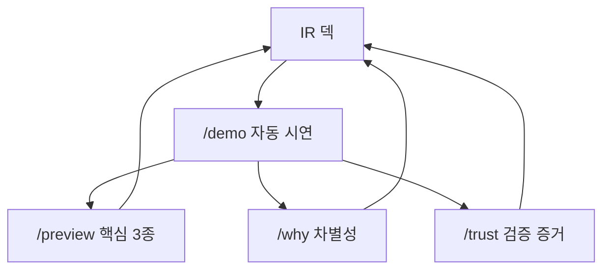

# SafeGuard v2 Build Spec

## 목적

SafeGuard v2의 목적은 과장된 IR 쇼가 아니라 제품 화면만으로 `누구를 위한 서비스인지`, `무엇이 실제로 작동하는지`, `무엇이 다음 투자금으로 확장될지`를 분리해 보여주는 것입니다.

이 문서는 세 가지 산출물을 하나의 실행 기준으로 묶습니다.

1. `/demo`: 30초 자동 시연 모드.
2. IR 덱: 제품 화면과 1:1로 연결되는 발표 구조.
3. 인터뷰: 안전관리자 검증 질문과 인사이트 정리 방식.

외부 API 호출부와 파싱 규칙은 변경하지 않습니다. 기상청, Law.go, Work24, KOSHA 응답은 기존 구현을 사용하고, v2-build는 제품 표현, 시연 흐름, 검증 증거 레이어만 추가합니다.

## Part 1. `/demo` 자동 시연 모드

### 목표

발표자가 긴 설명 없이도 SafeGuard의 핵심 가치를 보여줄 수 있어야 합니다. 기본 흐름은 `현장 입력 -> API 조합 -> 11종 문서 -> 핵심 3종 강조 -> 외국인 전송본`입니다.

### 30초 기본 흐름

| 시간 | 화면 | 목적 |
|---|---|---|
| 0초 | 시나리오 카드 | 현장 맥락 선택 |
| 3초 | 입력 자동 타이핑 | 자연어 입력 가치 전달 |
| 8초 | API 조합 펄스 | 공공데이터와 AI가 함께 작동함을 표시 |
| 15초 | 문서팩 생성 카운터 | 11종 산출물 생성 흐름 표시 |
| 22초 | 핵심 3종 쇼케이스 | 위험성평가표, TBM, 외국인 전송본 집중 |
| 30초 | 다국어 전송본 | 외국인 근로자 대응 차별점 표시 |

확장 데모는 5분 안에 끝나도록 구성합니다. 확장 순서는 4M 위험요인, 법령 매칭, 다현장 청사진, 감사 대응 기록, 로드맵, 신뢰 페이지입니다.

### 컴포넌트 트리

```tsx
<DemoPage>
  <DemoController />
  <DemoStageIndicator />
  <ScenarioSelector />
  <AutoTypingInput />
  <GenerationProgress />
  <PrimaryTriadShowcase />
  <LanguageCarousel />
  <PresenterModeOverlay />
  <OfflineCachedBanner />
  <DemoFooter />
</DemoPage>
```

### 컴포넌트 책임

- `DemoController`: 단축키, 진행 타이머, URL 파라미터를 제어합니다.
- `ScenarioSelector`: 서울, 인천, 안산, 부산, 광주 5개 현장을 선택합니다.
- `AutoTypingInput`: 현재 입력 문장을 실제 워크스페이스와 같은 문법으로 보여줍니다.
- `GenerationProgress`: 11종 문서 카운터와 기상청, Law.go, Work24, KOSHA 연결 상태를 표시합니다.
- `PrimaryTriadShowcase`: 위험성평가표, TBM, 외국인 전송본만 크게 보여줍니다.
- `LanguageCarousel`: 10개 언어를 한 번에 과밀하게 보여주지 않고 주요 3개와 더보기로 나눕니다.
- `OfflineCachedBanner`: API 지연 시 사전 캐시 응답을 사용 중임을 작은 배지로 알립니다.

### 단축키

| 키 | 동작 |
|---|---|
| Space | 다음 단계 |
| Left / Right | 이전 또는 다음 시나리오 |
| F1 | 서울 외벽도장 |
| F2 | 인천 물류·우천 |
| F3 | 안산 제조·화기 |
| F4 | 부산 밀폐공간 |
| F5 | 광주 화학물질 |
| R | 처음부터 다시 |
| O | 사전 캐시 응답 모드 |
| P | 발표자 노트 토글 |

### 라우트 파라미터

| URL | 동작 |
|---|---|
| `/demo` | 기본 자동 시연 |
| `/demo?step=N` | 특정 단계로 직접 진입 |
| `/demo?scenario=seoul` | 특정 시나리오 고정 |
| `/demo?mode=offline` | 사전 캐시 응답 모드 |
| `/demo?speed=fast` | 빠른 진행 |

### 시나리오 5종

| 시나리오 | 현장 입력 요약 | 강조 위험 | 강조 언어 |
|---|---|---|---|
| 서울 외벽도장 | 외벽 도장, 이동식 비계, 강풍 | 추락, 전도 | 베트남어, 중국어 |
| 인천 물류·우천 | 지게차 상하차, 젖은 바닥, 동선 겹침 | 충돌, 미끄럼 | 우즈베크어, 몽골어 |
| 안산 제조·화기 | 용접·절단, 고온, 환기 불량, 외국인 포함 | 화재, 흄 노출 | 태국어, 캄보디아어 |
| 부산 밀폐공간 | 시설 점검, 밀폐공간, 2인 작업 | 산소결핍, 중독 | 네팔어, 미얀마어 |
| 광주 청소·화학 | 청소, 산성 약품, 피부 노출 | 화학물질 노출 | 인도네시아어, 영어 |

### 완료 기준

- 시나리오 5종이 모두 기본 흐름을 끝까지 재생합니다.
- API 지연 또는 실패 시 사전 캐시 응답 모드로 전환되고, 화면에는 이를 정직하게 표시합니다.
- 핵심 3종은 실제 `/api/ask` 결과 또는 검증된 캐시 응답에서 생성된 문구만 사용합니다.
- 발표자가 단축키로 시나리오와 단계 이동을 제어할 수 있습니다.

## Part 2. IR 덱 매핑

### 구조

IR 덱은 4개 Act로 구성합니다.

| Act | 목적 | 연결 화면 |
|---|---|---|
| Hook | 문제와 30초 데모 | `/demo` |
| What | 제품과 차별성 | `/preview`, `/why` |
| Why | 시장 가설과 검증 증거 | `/trust` |
| How | 로드맵과 자금 사용 계획 | `/roadmap` |

### 25페이지 목차

| 페이지 | 제목 | 핵심 메시지 | 제품 연결 |
|---|---|---|---|
| 1 | 표지 | SafeGuard는 현장 한 줄을 실행 가능한 안전 문서팩으로 바꿉니다. | `/` |
| 2 | 문제 | 안전 문서 작성은 반복되고, 현장 언어와 근거는 흩어져 있습니다. | `/trust` |
| 3 | 현장 페인포인트 | 인터뷰에서 확인한 반복 작성, 외국인 교육, 제출 부담을 보여줍니다. | `/trust` |
| 4 | 30초 데모 | 입력부터 외국인 전송본까지 실제 흐름을 보여줍니다. | `/demo` |
| 5 | 가치 제안 | 위험성평가, TBM, 외국인 전송본을 한 번에 생성합니다. | `/preview` |
| 6 | 핵심 3종 | 가장 중요한 산출물 3개를 완성도 있게 보여줍니다. | `/preview` |
| 7 | 외국인 대응 | 쉬운 한국어와 주요 언어 전송본을 분리합니다. | `/demo` |
| 8 | API 조합 | 기상, 법령, 교육, KOSHA 근거를 문서 문장에 연결합니다. | `/why` |
| 9 | 차별성 | 템플릿, 검색기, 일반 챗봇과 다른 지점을 비교합니다. | `/why` |
| 10 | 면책과 안전장치 | 공식 근거 기반 보조자료와 현장 확인 원칙을 명시합니다. | `/trust` |
| 11 | 시장 | 안전관리 문서와 외국인 교육 문제의 범위를 설명합니다. | IR 자료 |
| 12 | 타이밍 | 법령, 외국인 근로자, 디지털 전환 흐름을 연결합니다. | IR 자료 |
| 13 | 인터뷰 인사이트 | 실제 대화에서 나온 페인포인트를 익명화해 보여줍니다. | `/trust` |
| 14 | 베타 후보 | 동의받은 범위 안에서 베타 의향과 PoC 후보를 표시합니다. | `/trust` |
| 15 | 가격 사다리 | Free부터 본사 운영까지 단계별 가치를 설명합니다. | `/roadmap` |
| 16 | 도입 가설 | 누가 사고, 누가 쓰고, 어떤 비용을 줄이는지 설명합니다. | IR 자료 |
| 17 | 팀과 자문 | 실제 참여 동의를 받은 구성과 자문 범위를 보여줍니다. | `/trust` |
| 18 | 6개월 로드맵 | 투자 이후 무엇을 먼저 만들지 보여줍니다. | `/roadmap` |
| 19 | 자금 사용 계획 | 개발, 도메인 검증, 법무, 시장 검증에 배분합니다. | `/roadmap` |
| 20 | 마일스톤 | 베타, 유료 파일럿, 팀 기능 순서로 진행합니다. | `/roadmap` |
| 21 | 리스크 | 번역 검수, 서식 수용, 책임 범위, API 장애 대응을 설명합니다. | `/trust` |
| 22 | 라이브 시연 | 5분 확장 데모를 실행합니다. | `/demo` |
| 23 | 측정 계획 | 재방문, 문서 저장, 전파, 교육 확인을 측정합니다. | `/roadmap` |
| 24 | 장기 비전 | 현장 안전 문서와 교육 운영의 표준 작업공간을 지향합니다. | `/roadmap` |
| 25 | Q&A | 데모 링크, 연락처, 후속 미팅 요청을 제공합니다. | `/demo` |

### 발표 버전

| 버전 | 사용 상황 | 슬라이드 |
|---|---|---|
| 짧은 소개 | 짧은 피칭 또는 부스 | 1, 4, 5, 9, 18, 25 |
| 표준 발표 | 정부 지원금, 엔젤 미팅 | 1~10, 13~15, 18~19, 22, 25 |
| 상세 발표 | 실사 또는 심층 미팅 | 전체 |

### 함정 질문 매핑

| 질문 | 제품에서 보여줄 위치 |
|---|---|
| 경쟁사는 무엇인가요? | `/why` |
| 번역 정확도는 어떻게 확인하나요? | `/trust`, `/preview` |
| 양식은 실제 제출에 쓸 수 있나요? | `/preview`, 면책 고지 |
| 사고가 나면 책임은 어떻게 되나요? | `/trust`, 출력물 푸터 |
| 투자금을 받으면 무엇을 먼저 하나요? | `/roadmap` |
| 실제 현장 검증은 어디까지 했나요? | `/trust` |

### 덱 원칙

- 슬라이드 제목은 결론형 문장으로 씁니다.
- 수치가 필요하면 출처가 있는 수치만 사용합니다.
- 제품에서 확인할 수 없는 주장은 넣지 않습니다.
- 동의받지 않은 로고, 실명, 사진, 인용문은 사용하지 않습니다.

## Part 3. 안전관리자 인터뷰 스크립트

### 목적

인터뷰의 목적은 투자자에게 보여주기 위한 장식이 아니라 제품의 가설을 실제 언어로 검증하는 것입니다. `/trust`에는 동의받은 범위의 익명 인사이트만 노출합니다.

### 대상 분포

| 분류 | 목표 |
|---|---|
| 중소 건설 현장 안전 담당 | 반복 문서 작성과 현장 운영 확인 |
| 중견 건설 또는 제조 안전팀 | 결재, 다현장, 제출 흐름 확인 |
| 외국인 근로자 포함 현장 관리자 | 언어별 교육과 전파 문제 확인 |
| 안전·노무 실무 자문 후보 | 문구, 면책, 서식 리스크 검토 |

### 인터뷰 운영

- 시간: 60분 기준.
- 방식: 화상 또는 대면.
- 기록: 녹화 또는 녹취 전 사전 동의.
- 인용: 익명 처리 후 본인 확인을 거친 문장만 외부 사용.
- 보관: 원본 기록은 내부 검토 목적으로만 보관하고 보관 기간을 정합니다.

### 질문 스크립트

#### 인트로

1. 오늘 인터뷰의 목적과 비공개 원칙을 설명합니다.
2. 녹화, 녹취, 익명 인용 가능 범위를 확인합니다.
3. 정답이 아니라 실제 업무 흐름을 듣고 싶다고 안내합니다.

#### A. 하루 업무 흐름

1. 어제 하루 안전관리 업무를 시간 순서대로 설명해 주세요.
2. 오늘 아침 TBM은 어떻게 진행하셨나요?
3. 이번 주 가장 시간을 많이 쓴 안전 업무는 무엇이었나요?
4. 최근 가장 부담이 컸던 안전 이슈는 무엇이었나요?

#### B. 문서 작성

1. 위험성평가표는 어떤 파일이나 시스템으로 작성하시나요?
2. TBM 기록은 어디에 남기고, 누가 확인하나요?
3. 안전보건교육 기록은 어떤 상황에서 다시 찾아보나요?
4. 외국인 근로자에게 안전 내용을 어떤 언어와 방식으로 전달하나요?
5. 원청, 발주처, 관공서 요청으로 문서를 다시 고친 경험이 있나요?

#### C. 현재 도구와 대안

1. 현재 쓰는 안전관리 시스템이나 문서 양식은 무엇인가요?
2. 만족하는 부분과 불편한 부분은 무엇인가요?
3. 새로운 도구를 도입하려면 누가 승인해야 하나요?
4. 회사 비용으로 도입한다면 어떤 증거가 필요할까요?

#### D. SafeGuard 반응

1. 데모를 본 뒤 가장 먼저 떠오른 사용 장면은 무엇인가요?
2. 위험성평가표, TBM, 외국인 전송본 중 가장 가치 있어 보이는 것은 무엇인가요?
3. 실제 현장에서 쓰기 전에 반드시 보완되어야 할 점은 무엇인가요?
4. 이 제품을 동료에게 설명한다면 어떤 말로 설명하시겠나요?

#### E. 후속 관계

1. 베타 사용에 관심이 있다면 어떤 조건이 필요할까요?
2. 다음 인터뷰 또는 화면 검토에 참여할 수 있나요?
3. 소개 가능한 다른 현장 담당자가 있나요?

### 인사이트 템플릿

```markdown
인터뷰 ID:
일시:
대상 유형:
역할:
현장 유형:

## 한 줄 페인포인트

## 외부 사용 가능 인용
- 본인 확인 필요:
- 익명화 상태:

## 현재 대안
- 파일:
- 시스템:
- 메신저:

## SafeGuard 반응
- 가장 가치 있어 보인 기능:
- 가장 보완이 필요한 기능:
- 도입 전 필요한 증거:

## 가격과 구매 흐름
- 개인 결제 의사:
- 회사 비용 처리 조건:
- 승인자:

## 베타 / PoC 의향
- 베타 관심:
- 추가 인터뷰 가능:
- LOI 후보 여부:

## 핵심 인사이트
1.
2.
3.

## 후속 액션
- [ ]
- [ ]
```

### `/trust` 노출 기준

`/trust`에는 다음만 노출합니다.

- 익명화된 페인포인트.
- 본인 확인을 거친 인용문.
- 실제 동의받은 자문 또는 인터뷰 참여 사실.
- 구속력 없음을 명시한 PoC 의향.
- 검증 예정 항목과 이미 확인한 항목의 구분.

## Part 4. 세 산출물 연결



세 산출물은 서로 독립된 자료가 아니라 순환 구조입니다. 발표 중에는 덱에서 제품으로 들어가고, 발표 후에는 제품에서 다시 덱의 근거를 확인할 수 있어야 합니다.

## Part 5. 완료 정의

### `/demo`

- 시나리오 5종이 자동 시연으로 끝까지 재생됩니다.
- API 지연 시 사전 캐시 응답 모드로 전환됩니다.
- 사전 캐시 응답 사용 여부가 화면에 표시됩니다.
- 단축키와 URL 딥링크가 작동합니다.

### IR 덱

- 25페이지 목차가 제품 라우트와 연결됩니다.
- 짧은 소개, 표준 발표, 상세 발표 버전이 준비됩니다.
- 함정 질문별 이동 화면이 정리됩니다.
- 제품에서 확인할 수 없는 주장은 제거됩니다.

### 인터뷰

- 인터뷰 기록 템플릿이 통일됩니다.
- 익명 인용과 외부 공개 동의 상태가 구분됩니다.
- `/trust`에 올릴 수 있는 항목과 내부 검토용 항목이 분리됩니다.
- 베타 후보와 후속 인터뷰 후보가 정리됩니다.

## Part 6. 의도적으로 만들지 않는 것

이번 v2-build에서는 다음을 구현하지 않습니다.

- 결제 시스템.
- 본격 다현장 백엔드.
- 모바일 앱.
- 카카오와 밴드 실제 발송.
- 사진 업로드 백엔드.
- 결재선 백엔드.
- 전체 사용자 권한 시스템.

현재 제품에서 이미 가능한 메일과 문자 전파는 유지합니다. 카카오와 밴드는 승인 및 채널 준비 후 확장합니다.

## Part 7. 다음 작업 순서

1. `/demo` 라우트와 사전 캐시 응답 구조를 먼저 만듭니다.
2. `/preview`에서 핵심 3종을 제품 완성본처럼 보여줍니다.
3. `/why`에서 경쟁 대안과 API 조합을 한 장으로 설명합니다.
4. `/trust`에는 실제 동의받은 인터뷰와 검증 예정 항목만 분리해 표시합니다.
5. `/roadmap`에는 투자 이후 6개월 실행계획을 연결합니다.

이 순서대로 진행하면 제품은 과장 없이도 IR용 설명력을 갖게 됩니다.
