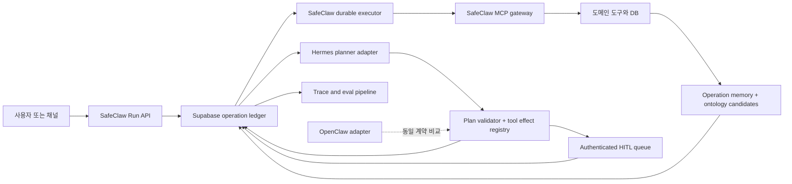

# HRMS Hermes와 SafeClaw 엔진 갭 독립 감사

- 감사 기준일: 2026-07-11 KST. 파일명은 요청된 2026-07-10 기준명을 유지한다.
- HRMS 감사 대상: `C:/Users/iceam/dev/hrms` @ `d9a7472f325cfa3fedc59c548c481ac9ea49bf5e`
- SafeClaw 비교 대상: 이 worktree @ `596ea1447702b4b13cf06f3b6014e7cb5e87e883`
- 판정어: `current`는 현재 코드에 연결되어 실행 가능한 상태, `partial`은 구성요소만 있거나 경로 일부만 연결된 상태, `absent`는 감사한 실행 경로에 구현이 없는 상태다.

## 1. 결론

HRMS에는 Hermes 연결이 실제로 있다. 외부 Hermes 소스 핀, 격리된 systemd 서비스 정의, OpenAI 호환 `HermesProvider`, 간단한 도구 호출 루프, Hermes가 호출할 수 있는 테넌트 바인딩 MCP 서버까지 코드로 확인된다. 다만 이것은 아직 **Hermes가 제품의 durable engine인 상태가 아니라, Hermes gateway를 LLM/agent provider로 붙인 PoC와 운영 배선**이다.

가장 중요한 차이는 다음과 같다.

1. HRMS의 로컬 `agent_loop`는 한 HTTP 요청 안의 메모리 리스트를 최대 단계 수까지 순회한다. 계획, 단계, 승인, 재시도, 복구 상태가 DB에 남지 않는다.
2. HRMS의 Hermes 어댑터는 요청에 정식 OpenAI `tools` 스키마를 보내지 않으면서 응답의 `tool_calls`는 해석한다. 동시에 Hermes gateway에는 별도의 MCP toolset이 설정된다. 따라서 로컬 레지스트리 실행과 Hermes 내부 MCP 실행이 하나의 검문소로 통합되어 있지 않다.
3. HRMS에는 `read_only` 승인 게이트와 별도의 인증된 급여 검토 API가 있지만, Hermes 실행 경로의 승인에는 인증 사용자, 권한, 승인 대상 payload digest, 만료, 재사용 방지가 연결되지 않았다.
4. HRMS 온톨로지는 `draft`/`published` 게이트와 검증기가 있는 좋은 기반이지만, 실행 이력에서 승인된 운영 지식을 축적하는 operation memory는 아니다.
5. SafeClaw도 현재 OpenClaw OAuth/CLI/MCP 연결은 갖췄지만, 채팅 히스토리는 stateless이고 durable planner/executor는 없다. 따라서 "OpenClaw 수준"을 이미 완성된 SafeClaw 상태로 간주하면 과장이다.

장기 목표는 가능하다. 권고 목표는 **Hermes를 SafeClaw의 주 planner/runtime engine으로 승격하되, SafeClaw MCP와 Supabase DB를 권한, 사실, 작업 상태, 승인, 감사의 system of record로 유지하는 것**이다. OpenClaw는 동일한 엔진 계약을 검증하는 호환 런타임이자 비교 기준으로 남긴다. Hermes가 DB를 직접 소유하거나 MCP를 우회하는 구조는 목표가 아니다.

## 2. 감사 범위와 한계

이번 감사에서 직접 확인한 것은 두 로컬 저장소의 현재 HEAD, 코드 경로, 테스트 결과다. HRMS 작업 트리에 이미 있던 `results.tsv`, `.claude/`, `.superpowers/` 변경은 읽기 기준에서 제외했고 수정하지 않았다.

다음은 이번 감사에서 직접 확인하지 못했다.

- `claudebot-2`의 현재 systemd 상태, 실제 Hermes 프로세스, 실제 OAuth 계정 상태
- `~/workspaces/hermes-agent`의 핀 커밋 소스와 현재 배포물이 일치하는지
- HRMS 문서에 기록된 과거 라이브 호출 및 도구 잠금 결과의 재현
- SafeClaw 프로덕션 Supabase와 OpenClaw 프로필의 현재 라이브 상태

HRMS 저장소에는 Hermes 전체 소스가 없고 핀과 배포 템플릿만 있다. 이 사실은 `HRMS/vendor/HERMES_PIN:1-5`와 `HRMS/scripts/hermes/gateway-config.template.yaml:13-14`에서 확인된다. 따라서 아래의 "current"는 코드 배선 판정이며 원격 서비스의 현재 가동 판정이 아니다.

## 3. 현재 HRMS Hermes 연결

### 3.1 실제 호출 경로

```text
주 AI 화면
KoreaAIChat.vue
  -> _api.chat_query_api
  -> ai_chat.chat_query retrieval 경로
  -> Hermes 미사용

채널의 명시적 에이전트 명령
/스킬 또는 /마감준비
  -> mcp_server/channel_core.py
  -> Frappe run_agent_skill
  -> in-memory agent_loop
  -> HermesProvider
  -> Hermes gateway /v1/chat/completions

Hermes 자체 도구 경로
Hermes gateway
  -> mcp-korea_hrms toolset
  -> HRMS FastMCP HTTP server
  -> 결정적 계산 도구 또는 테넌트 Frappe read-only bridge
```

주 AI 화면은 `HRMS/frontend/src/views/KoreaAIChat.vue:189-224`에서 `chat_query_api`를 호출하고, 해당 API는 `HRMS/hrms/regional/south_korea/_api.py:28-79`에서 retrieval 기반 `chat_query`로 간다. Hermes 경로는 `HRMS/mcp_server/channel_core.py:91-177`의 `/스킬`, `/마감준비` 명령과 Frappe RPC 호출에서 확인된다. 따라서 "HRMS AI 전체가 Hermes 엔진으로 전환됐다"고 말할 근거는 없다.

### 3.2 구현되어 있는 부분

| 영역 | 코드 근거 | 판정 |
|---|---|---|
| 외부 Hermes 핀과 서비스 | `HRMS/vendor/HERMES_PIN:1-5`, `HRMS/scripts/systemd/hermes-gateway.service:11-22` | 외부 소스 위치, 격리 `HERMES_HOME`, 재시작 정책이 명시되어 있다. |
| Hermes provider adapter | `HRMS/hrms/regional/south_korea/agent_harness/hermes_provider.py:46-101` | OpenAI 호환 chat completions 호출과 첫 `tool_call` 매핑이 구현됐다. |
| Frappe 연결 | `HRMS/hrms/regional/south_korea/agent_harness_api.py:96-192`, `HRMS/hrms/regional/south_korea/agent_harness_api.py:219-246` | site config가 `hermes`일 때 자격증명과 gateway URL로 provider를 만든다. |
| 단순 agent loop | `HRMS/hrms/regional/south_korea/agent_harness/agent_loop.py:25-96` | 최대 단계 수, 도구 호출, 결과 피드백, 최종 텍스트 반환이 있다. |
| 도구 allowlist | `HRMS/hrms/regional/south_korea/agent_harness/tool_registry.py:24-106` | 등록 도구만 실행하고 `read_only=False`를 bool 승인으로 막는다. 로그는 프로세스 메모리에만 누적한다. |
| PII 방어 | `HRMS/hrms/regional/south_korea/agent_harness_api.py:67-83`, `HRMS/hrms/regional/south_korea/agent_harness_api.py:158-175` | 도구 결과가 LLM으로 가기 전에 구조적 redaction proxy를 통과한다. |
| Hermes 도구 잠금 템플릿 | `HRMS/scripts/hermes/gateway-config.template.yaml:42-53` | gateway의 활성 toolset을 `mcp-korea_hrms`로 제한하는 설정이 있다. |
| MCP 계산 도구 | `HRMS/mcp_server/server.py:63-226` | 연차, 퇴직금, 시급, 보험 대사, 근태, 법정 급여, compliance, retrieval Q&A를 결정적 도구로 노출한다. |
| MCP 테넌트 bridge | `HRMS/mcp_server/http_server.py:35-42`, `HRMS/mcp_server/http_server.py:47-107`, `HRMS/mcp_server/http_server.py:519-560` | Bearer 해시로 site를 찾고 허용 DocType과 필드만 Frappe REST로 읽는다. |
| 승인된 온톨로지 조회 | `HRMS/hrms/regional/south_korea/ontology/loader.py:21-78`, `HRMS/hrms/regional/south_korea/ontology/statutory_ontology.py:25-44` | 기본 조회는 `published`만 반환하고 확정 법정값도 published 노드에서 읽는다. |
| 인증된 도메인 검토 API | `HRMS/hrms/regional/south_korea/payroll_closing_draft_review_runtime_api.py:31-88` | Frappe session actor 일치, `HR Manager`, DocType write 권한을 확인하는 좁은 mutation 경로가 있다. |

### 3.3 엔진으로 보기 어려운 부분

#### A. 로컬 도구 루프와 Hermes MCP 실행 경계가 이중화되어 있다

`HermesProvider` 요청 payload는 `model`과 `messages`만 포함한다(`HRMS/hrms/regional/south_korea/agent_harness/hermes_provider.py:71-80`). 로컬 레지스트리의 정식 tool schema를 전송하지 않지만 응답에서는 `tool_calls`를 읽는다(`HRMS/hrms/regional/south_korea/agent_harness/hermes_provider.py:91-101`). 반면 gateway 설정은 Hermes가 `mcp-korea_hrms`를 직접 쓰도록 한다(`HRMS/scripts/hermes/gateway-config.template.yaml:46-53`).

이 구조에서는 두 실행 방식이 가능하다.

- Hermes가 내부 MCP를 실행하고 최종 텍스트만 반환한다.
- gateway가 `tool_calls`를 반환하면 HRMS의 메모리 루프가 로컬 도구를 실행한다.

현재 코드에는 두 경로를 동일한 run/step, 승인, idempotency, trace로 묶는 단일 executor가 없다. SafeClaw로 이식할 때는 Hermes가 MCP를 직접 호출하더라도 모든 호출이 SafeClaw operation interceptor를 통과하도록 한 경로로 수렴해야 한다.

#### B. planner는 선언이 아니라 프롬프트다

스킬의 `steps`는 registry 데이터이지만(`HRMS/hrms/regional/south_korea/agent_harness/skill_registry.py:7-21`), `run_agent_skill`은 이를 DB 계획이나 결정적 실행 목록으로 만들지 않고 시스템 프롬프트에 넣는다(`HRMS/hrms/regional/south_korea/agent_harness_api.py:161-175`). 실제 다음 행동은 provider 응답이 결정한다.

기본 스킬과 기본 도구 사이에도 정적 정합성 검사가 없다. `insurance_reconcile`은 `reconcile_contributions`와 `summarize_reconciliation_ko`를 요구하지만(`HRMS/hrms/regional/south_korea/agent_harness/builtin_skills.py:33-43`), 기본 runtime registry는 `list_hourly_payroll_proposals`와 `reconcile_period_contributions`만 등록한다(`HRMS/hrms/regional/south_korea/agent_harness_api.py:249-279`). 테스트용 registry로는 실행할 수 있어도 기본 실행 경로가 해당 두 단계를 보장하지 않는다.

#### C. 승인 bool은 authenticated HITL이 아니다

`ToolRegistry.call`은 `human_approved is True`만 확인한다(`HRMS/hrms/regional/south_korea/agent_harness/tool_registry.py:70-96`). 테스트는 provider가 응답에 `human_approved: True`를 넣으면 write 도구가 실행되는 계약을 명시한다(`HRMS/hrms/tests/test_korea_agent_harness_agent_loop.py:109-137`). 이 값에는 승인자, 세션, 역할, 대상 payload digest, 승인 시각, 만료, 일회성 nonce가 없다.

동시에 live `HermesProvider`는 반환하는 `tool_call`에 `human_approved`를 넣지 않는다(`HRMS/hrms/regional/south_korea/agent_harness/hermes_provider.py:91-101`). `run_agent_skill`의 공개 `human_approved` 인자도 선언과 문서화만 되어 있고 실행 루프에 전달되지 않는다(`HRMS/hrms/regional/south_korea/agent_harness_api.py:96-113`, `HRMS/hrms/regional/south_korea/agent_harness_api.py:148-175`). 기본 도구도 모두 read-only다(`HRMS/hrms/regional/south_korea/agent_harness_api.py:249-279`). 즉 현재 기본 경로는 mutation을 안전하게 승인하는 것이 아니라 mutation 경로가 사실상 미완성인 상태다.

#### D. durable state와 operation memory가 없다

agent loop의 대화, tool call, status는 지역 변수와 반환 dict다(`HRMS/hrms/regional/south_korea/agent_harness/agent_loop.py:50-96`). `ToolRegistry` 로그도 인스턴스 list다(`HRMS/hrms/regional/south_korea/agent_harness/tool_registry.py:27-29`, `HRMS/hrms/regional/south_korea/agent_harness/tool_registry.py:98-106`). 프로세스 종료 후 재개할 run ID, step lease, checkpoint, output reference가 없다.

`HermesProvider`는 선택적 `X-Hermes-Session-Id`를 지원하지만(`HRMS/hrms/regional/south_korea/agent_harness/hermes_provider.py:46-60`, `HRMS/hrms/regional/south_korea/agent_harness/hermes_provider.py:71-79`), Frappe provider 생성 경로는 session ID를 전달하지 않는다(`HRMS/hrms/regional/south_korea/agent_harness_api.py:219-246`). 이 선택적 헤더도 제품 operation memory나 복구 원장이 아니다.

#### E. provider auth와 MCP auth의 책임이 흐리다

HRMS 자격증명 resolver는 테넌트 또는 플랫폼 LLM API key를 고르고(`HRMS/hrms/regional/south_korea/agent_harness/llm_credentials.py:35-77`), `HermesProvider`는 그 값을 gateway의 Bearer header로 보낸다(`HRMS/hrms/regional/south_korea/agent_harness/hermes_provider.py:62-79`). 반면 systemd 주석은 gateway 접근 토큰과 Hermes upstream OAuth/env를 별개로 설명한다(`HRMS/scripts/systemd/hermes-gateway.service:5-6`). 저장소 코드만으로는 테넌트 provider OAuth credential을 gateway 요청에 안전하게 위임하는 계약이 확인되지 않는다.

MCP auth는 별도다. HRMS는 MCP bearer의 sha256만 key로 저장하지만, 같은 로컬 binding 파일에 Frappe `api_key`와 `api_secret`을 평문으로 기록한다(`HRMS/mcp_server/issue_token.py:27-49`). 파일 권한은 제한하지만, 이 모델을 SafeClaw의 다중 테넌트 credential system으로 복제하면 안 된다.

#### F. trace, eval, recovery는 실행 엔진에 연결되지 않았다

현재 엔진 경로가 남기는 것은 반환 payload의 `tool_calls`, Frappe error log 시도, MCP usage JSONL 정도다. 통합 run ID, step ID, prompt/tool schema 버전, input/output hash, token/cost, approval event, provider receipt, 재시도 이유를 연결하는 trace가 없다.

MCP의 usage log는 OSError를 무시하고(`HRMS/mcp_server/http_server.py:169-187`), quota는 파일 기반이다(`HRMS/mcp_server/http_server.py:136-166`). 카카오 모듈에는 queue/retry event를 만드는 좋은 계약 조각이 있지만 실제 durable queue 저장소가 아니며(`HRMS/hrms/regional/south_korea/kakao_notification.py:470-511`, `HRMS/hrms/regional/south_korea/kakao_notification.py:615-725`), engine recovery나 dead-letter queue로 배선되지 않았다.

## 4. 재사용 가능 패턴과 금지 패턴

### 4.1 재사용 가능

| 패턴 | 가져올 부분 | SafeClaw 적용 방식 |
|---|---|---|
| 외부 runtime adapter | `HermesProvider`처럼 engine-specific transport를 작은 adapter로 격리 | `EngineAdapter` 계약 뒤에 Hermes와 OpenClaw driver를 각각 둔다. |
| 격리 배포 | 별도 작업 디렉터리, 별도 runtime home, restart 정책 | Hermes worker는 별도 서비스로 운영하되 DB credential을 주지 않는다. |
| 결정적 도메인 도구 | 계산을 LLM 추론 대신 코드/MCP에 둔 HRMS 도구 | SafeClaw의 위험성평가, 근거 조회, 문서 검수, 전파 도구도 MCP가 소유한다. |
| tenant-bound MCP | Bearer를 site binding으로 바꾸고 read-only bridge를 제한 | SafeClaw의 DB `mcp_tokens`와 site/org context를 계속 권한 경계로 사용한다. |
| 구조적 PII redaction | LLM 직전 proxy에서 tool result를 정화 | tool response뿐 아니라 trace/eval export에도 같은 정책을 적용한다. |
| ontology publication gate | `draft`와 `published`를 분리하고 기본 조회를 published로 제한 | SafeClaw의 `draft/verified/published` DB 게이트와 promotion workflow를 강화한다. |
| 인증 actor 검증 | session actor, 역할, DocType write 권한을 함께 확인 | SafeClaw approval API가 Supabase user와 org/site role을 확인하고 payload digest에 서명한다. |
| 도메인 retry contract | attempt, max attempts, next retry, provider status의 구조 | 범용 operation step schema로 일반화하고 실제 DB lease/worker에 연결한다. |

### 4.2 금지

1. 모델이나 provider가 반환한 `human_approved: true`를 승인으로 신뢰하지 않는다.
2. 프롬프트의 "셸 사용 금지"를 보안 경계로 취급하지 않는다.
3. Hermes 직접 MCP 실행과 SafeClaw 로컬 tool registry 실행을 별도 감사 경로로 두지 않는다.
4. Hermes worker에 Supabase service role, tenant DB credential, provider refresh token을 직접 주지 않는다.
5. runtime session, JSONL, Markdown, 프로세스 메모리를 제품의 사실 원장으로 사용하지 않는다.
6. tenant 작업 이력을 자동으로 public ontology나 공용 corpus로 승격하지 않는다.
7. 장시간 동기 HTTP 요청 하나를 durable workflow로 부르지 않는다.
8. file-based quota, usage log, secret binding을 상용 다중 테넌트 권한 시스템으로 이식하지 않는다.
9. tool exception을 LLM 대화에만 넣고 운영 실패 상태를 저장하지 않는 패턴을 쓰지 않는다.
10. provider OAuth와 MCP tenant auth를 하나의 Bearer나 하나의 설정값으로 합치지 않는다.

HRMS의 자체 운영 문서는 과거 Hermes가 로컬 registry를 우회해 자체 셸 도구를 사용했고 여러 사이트 접근 흔적이 있었다고 기록한다(`HRMS/docs/korea_hrms/hermes-embedding.md:50-80`). 이번 감사에서 그 사건을 재현하지는 않았지만, 현재 gateway allowlist를 선택사항이 아닌 배포 gate로 유지해야 하는 이유로는 충분하다.

## 5. SafeClaw MCP/DB를 system of record로 유지해야 하는 이유

SafeClaw에는 runtime보다 오래 살아야 하는 제품 상태가 이미 있다.

- 조직, 현장, 근로자, workpack, 교육, dispatch log는 Supabase 스키마에 연결되어 있다(`SafeClaw/supabase/migrations/002_workspace_productization.sql:3-104`).
- MCP token은 평문이 아닌 해시와 site/org/scope를 DB에 저장한다(`SafeClaw/supabase/migrations/007_mcp_tokens.sql:1-33`).
- ontology node/edge는 publication state와 RLS를 가진다(`SafeClaw/supabase/migrations/008_safety_ontology.sql:1-45`).
- 개선사항은 candidate, approved, rejected, reflected 상태와 승인자를 보존한다(`SafeClaw/supabase/migrations/010_commercial_operations.sql:51-68`).
- workpack 저장은 generation evidence 검증과 site/org 일치를 통과해야 한다(`SafeClaw/lib/workpack-store.ts:190-265`).
- DB harness packet은 LLM 역할을 `naturalize_only`, 근거 권위를 `db_harness`로 제한한다(`SafeClaw/lib/db-harness.ts:73-98`, `SafeClaw/lib/db-harness.ts:221-283`).

Hermes는 계획과 언어 추론을 잘하는 engine이 될 수 있지만 다음 질문의 최종 답을 소유해서는 안 된다.

- 어떤 조직과 현장의 작업인가
- 어떤 근거와 ontology version을 사용했는가
- 어떤 도구가 어떤 효과를 일으켰는가
- 누가 어떤 payload를 승인했는가
- 외부 발송이나 DB 변경이 실제로 한 번만 일어났는가
- 실패 후 어디서 재개해야 하는가

이 답들은 SafeClaw DB와 MCP control plane이 소유해야 runtime 교체, 모델 교체, worker 재시작, 장애 복구에도 동일하게 남는다. Hermes와 OpenClaw가 같은 MCP 계약을 소비하면 엔진을 비교하거나 교체해도 제품 사실은 갈라지지 않는다.

### 5.1 인증은 네 층으로 분리한다

| 인증 층 | 답하는 질문 | 권고 소유자 |
|---|---|---|
| 사용자 인증 | 누가 요청하고 승인하는가 | Supabase Auth와 org/site role |
| provider 인증 | 어떤 모델 계정으로 추론하고 누가 비용을 부담하는가 | Hermes/OpenClaw runtime의 OAuth 또는 provider vault |
| MCP 인증 | 어떤 org/site의 어떤 tool scope를 쓸 수 있는가 | SafeClaw DB `mcp_tokens`와 MCP gateway |
| executor capability | 승인된 특정 step을 한 번 실행할 수 있는가 | SafeClaw가 발급하는 짧은 수명의 step-bound capability |

SafeClaw의 현재 OpenClaw 경로는 `openai/oauth` profile을 코드로 확인한다(`SafeClaw/lib/openclaw-chat.ts:50-59`, `SafeClaw/lib/openclaw-chat.ts:158-223`). MCP는 별도로 Bearer hash를 site/org context로 바꾼다(`SafeClaw/lib/mcp-auth.ts:1-12`, `SafeClaw/lib/mcp-auth.ts:74-103`, `SafeClaw/lib/mcp-auth.ts:143-185`). 이 분리를 Hermes에도 그대로 적용해야 한다.

## 6. 목표 아키텍처



핵심 계약은 다음과 같다.

1. Hermes는 plan 또는 tool intent를 제안한다.
2. SafeClaw validator가 등록된 tool, tenant scope, effect, 승인 정책을 검사한다.
3. SafeClaw DB가 run과 step을 먼저 저장한 뒤 executor가 실행한다.
4. read/compute는 정책상 자동 실행할 수 있다.
5. state write, 외부 발송, 비가역 효과는 approval request를 만들고 run을 중지한다.
6. 사용자가 로그인 세션으로 정확한 payload diff를 승인하면 executor가 일회성 capability로 MCP를 호출한다.
7. MCP receipt와 DB row가 성공을 확정하기 전에는 step을 완료로 표시하지 않는다.
8. Hermes session memory는 편의용 context일 뿐이며 operation memory는 DB 사건에서 재구성한다.

## 7. 단계별 구현 계획

모든 신규 DB 테이블과 migration 적용은 별도 사용자 승인 gate를 거쳐야 한다.

### 단계 0. 계약 동결과 비교 기준

산출물은 현재 MCP tool catalog, 입력/출력 schema hash, SafeClaw harness packet fixture, OpenClaw 기준 trajectory fixture다. HRMS의 adapter를 복사하기 전에 SafeClaw의 tool 이름과 결과 계약을 기준으로 고정한다.

완료 gate는 Hermes와 OpenClaw가 동일한 read-only 시나리오에서 같은 MCP tool 이름, tenant attribution, evidence packet version을 사용하고, 결과 차이가 자연어 표현에만 있는 것이다.

### 단계 1. Tool Effect Registry

각 tool에 `effectClass`, `replayPolicy`, `approvalPolicy`, `tenantScope`, `dataSensitivity`, `timeout`, `retryPolicy`, `compensation`, `resultReceipt`를 선언한다. 최소 effect class는 `read`, `compute`, `draft_write`, `state_write`, `external_send`, `destructive`로 둔다.

registry는 모델 prompt용 설명이 아니라 서버 정책 코드다. MCP 등록, planner validation, executor, audit UI가 같은 registry snapshot을 사용하고 version/hash를 run에 저장한다. 현재 `mcp-auth`의 scope 배열도 이 단계에서 tool별로 실제 enforcement한다.

완료 gate는 미등록 tool, scope 불일치, effect metadata 누락, direct effectful call이 모두 실행 전 차단되는 것이다.

### 단계 2. Durable Planner/Executor

DB 모델은 최소 `agent_runs`, `agent_steps`, `operation_events`, `tool_receipts`를 가진다. run에는 tenant, requester, engine, model, prompt/registry version, 상태를 저장한다. step에는 순서, tool intent, canonical args hash, effect class, dependency, attempt, lease, output reference를 저장한다.

planner는 side effect를 실행하지 않고 plan만 제출한다. validator가 plan을 정규화한 뒤 executor가 DB row lease를 얻어 MCP를 호출한다. 권고 run 상태는 `requested -> planning -> ready -> running -> awaiting_approval -> succeeded | failed | cancelled | dead_lettered`다.

완료 gate는 worker를 강제 종료한 뒤 같은 run ID로 중복 실행 없이 마지막 미완료 step부터 재개되는 것이다.

### 단계 3. OAuth/Provider와 MCP Auth 분리

Hermes의 upstream model OAuth/API credential은 runtime 전용 vault에 둔다. SafeClaw는 토큰 원문을 저장하지 않고 provider account reference와 billing mode만 기록한다. Hermes worker에는 site-scoped MCP credential만 주며 Supabase service role은 주지 않는다.

MCP auth는 `orgId`, `siteId`, tool scopes를 강제하고, engine 종류와 무관하게 같은 정책을 적용한다. OpenClaw의 `openai/oauth` 검증은 conformance fixture로 재사용한다.

완료 gate는 provider credential만으로 MCP를 호출할 수 없고, MCP token만으로 model provider에 접근할 수 없으며, cross-site 요청이 차단되는 것이다.

### 단계 4. Authenticated HITL

`approval_requests`와 append-only `approval_events`를 추가한다. approval request는 run/step, canonical args digest, 예상 effect, 대상 site, diff preview, requester, expiry, nonce를 포함한다. 승인 API는 로그인 사용자와 org/site role을 확인하고 actor를 요청 body가 아니라 세션에서 가져온다.

승인 후에는 해당 step과 payload digest에만 유효한 일회성 executor capability를 발급한다. 모델이 승인 문구나 bool을 생성해도 정책 상태는 변하지 않는다. payload가 바뀌면 기존 승인은 무효다.

완료 gate는 위조 bool, replay, 만료 승인, 다른 payload, 다른 site, 권한 없는 사용자의 승인이 모두 차단되는 것이다.

### 단계 5. Idempotency, Recovery, Dead Letter

effectful step의 idempotency key는 `tenant + tool + canonical args + business key + plan version`으로 만든다. 외부 provider가 idempotency key를 지원하면 함께 전달하고 provider receipt를 저장한다. DB write는 unique constraint 또는 compare-and-set을 사용한다.

retry는 transient와 permanent를 registry에서 구분하고 exponential backoff, jitter, max attempts, `next_attempt_at`을 DB에 저장한다. lease timeout은 recovery worker가 회수한다. max attempts, policy violation, unknown outcome은 dead letter로 보내고 운영자에게 retry, compensate, mark-resolved 선택지를 제공한다.

완료 gate는 timeout 직후 재시도, duplicate webhook, worker crash, provider success 후 응답 유실, poison input 시나리오에서 효과가 중복되지 않는 것이다.

### 단계 6. Operation Memory와 Ontology

operation memory는 승인된 DB 사건에서만 만든다. `Workpack`, `Hazard`, `Control`, `Evidence`, `Improvement`, `Ack`에 더해 `Run`, `Step`, `Approval`, `Receipt`를 연결한다. 현재 SafeClaw graph builder는 DB workpack, 개선사항, 확인 이력을 조립하는 기반이 있다(`SafeClaw/lib/ontology/operation-memory.ts:8-54`, `SafeClaw/lib/ontology/operation-memory.ts:81-271`; `SafeClaw/app/api/workpacks/[id]/operation-graph/route.ts:97-177`).

tenant memory는 해당 tenant retrieval에만 사용한다. public ontology 변경은 `candidate -> reviewed -> verified -> published` promotion으로 분리하고 source record, approver, graph validation 결과를 남긴다. Hermes는 candidate를 제안할 수 있지만 publish할 수 없다.

완료 gate는 다른 tenant memory가 검색되지 않고, unapproved event와 failed step이 사실 또는 public ontology로 승격되지 않는 것이다.

### 단계 7. Trace와 Eval

모든 run/step에 correlation ID를 부여하고 engine/model, prompt hash, tool schema hash, input/output hash, latency, token/cost, retry, approval, receipt를 연결한다. PII 원문 대신 redacted view와 encrypted restricted payload를 분리한다.

eval은 결과 문장만 보지 않는다. plan validity, tool selection, evidence adherence, approval compliance, tenant isolation, recovery correctness, duplicate-effect prevention을 trajectory 단위로 평가한다. 동일 fixture를 Hermes와 OpenClaw adapter에 실행해 parity report를 만든다.

완료 gate는 하나의 run ID로 사용자 요청부터 MCP receipt와 최종 workpack까지 재구성할 수 있고, 실패 이유가 LLM 서술이 아니라 구조화 event로 설명되는 것이다.

### 단계 8. Hermes Shadow, 제한적 승격, OpenClaw parity

먼저 Hermes를 read-only shadow planner로 붙여 OpenClaw 또는 현재 deterministic path와 계획만 비교한다. 다음으로 `draft_write`까지 허용하되 외부 발송은 금지한다. HITL, idempotency, recovery, trace gate를 통과한 뒤에만 effectful tool을 소수 tenant에서 canary로 연다.

Hermes를 주 engine으로 승격한 뒤에도 OpenClaw adapter는 같은 fixture를 정기 실행하는 compatibility oracle과 비상 대체 경로로 유지한다. 두 runtime 모두 SafeClaw MCP와 operation ledger를 우회할 수 없다.

완료 gate는 Hermes 장애 시 동일 run을 다른 adapter가 DB checkpoint에서 이어받고, 이미 성공한 effectful step을 재실행하지 않는 것이다.

## 8. Current / Partial / Absent 매트릭스

상태는 해당 저장소 전체의 존재 여부가 아니라 **SafeClaw 목표에 필요한 end-to-end 엔진 capability** 기준이다.

| Capability | HRMS 현재 | SafeClaw 현재 | 목표 판정 |
|---|---|---|---|
| Hermes gateway 연결 | `current` | `absent` | SafeClaw engine adapter로 추가 |
| OpenClaw runtime 연결 | `absent` | `current` | Hermes와 같은 adapter 계약으로 유지 |
| 주 사용자 경로의 agent 실행 | `partial` | `partial` | UI/API/채널이 durable run API로 수렴 |
| 정식 tool schema와 단일 실행 경계 | `partial` | `partial` | MCP operation interceptor 한 경로 |
| deterministic domain tools | `current` | `current` | MCP가 계속 소유 |
| tenant-bound MCP identity | `current` | `current` | DB scope enforcement까지 완성 |
| tool별 scope enforcement | `partial` | `partial` | registry와 MCP에서 이중 확인 |
| Tool Effect Registry | `partial` | `absent` | effect/replay/approval 정책 필수 |
| Durable planner | `absent` | `absent` | DB plan과 version 필요 |
| Durable executor와 step lease | `absent` | `absent` | DB worker와 checkpoint 필요 |
| Authenticated HITL | `partial` | `partial` | actor, role, digest, expiry, nonce 필요 |
| Provider OAuth 분리 | `partial` | `current` | Hermes도 runtime vault로 분리 |
| Operation memory | `absent` | `partial` | DB event 기반 run/step graph로 확장 |
| Governed ontology | `partial` | `current` | promotion audit와 tenant/public 분리 강화 |
| Unified trace | `partial` | `partial` | run-to-receipt correlation 필요 |
| Trajectory eval | `absent` | `partial` | Hermes/OpenClaw 동일 fixture 필요 |
| Generic idempotency | `partial` | `partial` | effectful step unique contract 필요 |
| Crash recovery | `absent` | `absent` | lease 회수와 checkpoint resume 필요 |
| Dead-letter 처리 | `absent` | `absent` | terminal queue와 운영자 조치 필요 |
| Engine-independent system of record | `partial` | `current` | SafeClaw DB/MCP 경계 유지 |

## 9. 장기 목표 가능성 판정

판정은 **조건부 가능**이다.

HRMS에서 재사용할 가치가 있는 것은 Hermes 연결 경험, adapter 격리, MCP allowlist, deterministic tool, ontology publication gate, 인증된 좁은 mutation API다. 그러나 HRMS 구현을 그대로 옮기면 Hermes를 호출하는 synchronous PoC가 하나 더 생길 뿐, SafeClaw의 durable engine이 되지는 않는다.

Hermes가 SafeClaw의 주 engine이 되기 위한 선행 조건은 다음과 같다.

1. SafeClaw DB에 durable run/step/approval/receipt/dead-letter 원장이 있다.
2. 모든 Hermes tool intent가 versioned Tool Effect Registry와 MCP interceptor를 통과한다.
3. effectful tool은 인증된 사용자 승인과 일회성 executor capability 없이는 실행되지 않는다.
4. provider OAuth, user auth, MCP auth, executor capability가 분리된다.
5. tenant operation memory와 public ontology promotion이 분리된다.
6. crash, timeout, duplicate, unknown-outcome 복구 테스트가 통과한다.
7. Hermes와 OpenClaw가 같은 fixture에서 tenant attribution과 evidence contract parity를 보인다.

이 조건을 만족하면 `engine = Hermes`, `capability benchmark = OpenClaw-compatible`, `system of record = SafeClaw MCP/DB`라는 구성이 성립한다. 이 세 역할을 하나로 합치는 것은 장기 목표가 아니라 데이터와 권한 경계를 약화시키는 회귀다.

## 10. 검증 기록

다음 테스트를 `PYTHONDONTWRITEBYTECODE`와 같은 효과를 내는 `python -B`로 실행했고 모두 통과했다.

| 명령 | 결과 |
|---|---|
| `python -B hrms/tests/test_korea_agent_harness_hermes_provider.py` | 9 tests OK |
| `python -B hrms/tests/test_korea_agent_harness_agent_loop.py` | 10 tests OK |
| `python -B hrms/tests/test_korea_agent_harness_tool_registry.py` | 13 tests OK |
| `python -B hrms/tests/test_korea_agent_harness_api.py` | 15 tests OK |
| `python -B hrms/tests/test_korea_mcp_hourly_recon_tools.py` | 7 tests OK |
| `python -B hrms/tests/test_korea_ontology_loader.py` | 8 tests OK |
| `python -B hrms/tests/test_korea_ontology_validate.py` | 6 tests OK |
| `python -B hrms/tests/test_korea_statutory_ontology.py` | 5 tests OK |

합계 73개 targeted test가 통과했다. 이 테스트들은 adapter shape, 메모리 루프, bool 승인 게이트, MCP 계산 코어, ontology loader/validator를 검증한다. Hermes provider 테스트 자체가 injected transport와 실 HTTP 0회를 명시하므로(`HRMS/hrms/tests/test_korea_agent_harness_hermes_provider.py:1-5`), 통과 결과를 라이브 Hermes 연결 증거로 확대 해석하지 않는다.
